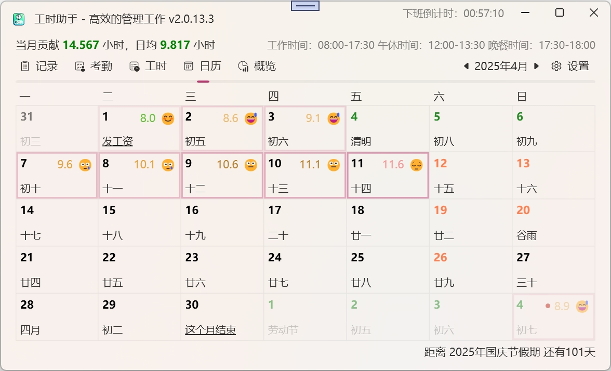

# PunchPal ⏱️ 工时统计小助手

> ⏳ 一款优雅、强大且高度可定制的 WPF 工时管理工具

[](https://github.com/HeHang0/PunchPal/releases)
[](https://github.com/hehang0/PunchPal/blob/master/LICENSE)
[](https://github.com/996icu/996.ICU)
[](https://github.com/hehang0/PunchPal/stargazers)
[](https://github.com/hehang0/PunchPal/network)
[](https://github.com/hehang0/PunchPal/issues)

简体中文 | [English](./README.en.md)

---

## ✨ 主要功能

- 下班倒计时提醒  
- 自动从远程数据源同步打卡与考勤  
- 工时统计与图表总览  
- 日历展示支持农历、节气、节假日  
- 个性化界面主题与窗口特效  
- 灵活的数据源接入配置  
- 多维度设置项，涵盖时间规则、代理、同步等  

---

## 🖥 主界面概览



---

## 📁 功能标签页

### 📌 记录

- 显示当月打卡记录（时间、备注、用户、来源）  
- 支持双击删除记录  

### 📌 考勤

- 显示当月请假、出差等考勤记录  
- 包含：日期、ID、类型、开始时间、结束时间、备注  
- 支持双击删除记录  

### 📌 工时

- 每日工时计算，包括迟到早退分析  
- 列项：日期、上下班时间、工时、迟到/早退分钟数、备注  

### 📌 日历

- 方块形式展示每一天，包括：  
  - 左上：日期  
  - 右上：工时  
  - 左下：农历、节气、节假日、自定义事件  
- 底部：本月重要事项倒计时、最近假期倒计时  

### 📌 概览

- 左侧图形展示：  
  - 标准工作时长  
  - 工作日加班时长  
  - 节假日加班时长  
- 右侧文本说明：  
  - 总贡献、日均工作时间  
  - 自定义提醒（如“工时超标，请注意休息”等）

---

## ⚙️ 设置面板

### 常规

- 开机启动、快捷键  
- 上下班打卡提醒（定时或系统事件触发）  

### 数据

- 同步时间、工时分界点  
- 是否计入非工作时间打卡、请假记录、节假日加班等  

### 日历

- 起始星期、自定义节日、节气显示  
- 月度重要日程倒计时设置  

### 个性化

- 主题模式（浅色 / 深色 / 跟随系统）  
- 窗口特效（默认、Tabbed、Mica、Acrylic）  
- 自定义背景图（支持透明度、模糊度）  

### 工作时间

- 列表管理多个时间段（工作、午餐、晚餐）  
- 支持配置弹性时间与容错时间  

### 网络

- 支持 HTTP 代理配置（不使用 / 系统代理 / 自定义）  

### 关于

- 检查更新、反馈、仓库地址、版本号展示  

---

## 🔌 数据源系统（高级功能）

支持多类型数据接入：

- 认证  
- 用户信息  
- 打卡记录  
- 考勤记录  
- 日历记录  

配置项包括：

- 请求类型：GET / POST / PUT / Browser 自动化请求  
- 请求头/体支持使用占位符（如 `{YEAR}`、`{DAYSTART}` 等）  
- Browser 请求类型支持 Cookie 自动提取与页面监听  
- 响应可写 JS 脚本，处理返回文本为标准 JSON 格式：

```ts
interface User {
  userId: string;
  name: string;
  avatar: string;
  remark: string;
}

interface PunchRecord {
  punchTime: number; // 秒时间戳 +8h
  punchType: string;
  remark: string;
}

interface AttendanceRecord {
  attendanceId: string;
  attendanceTypeId: string;
  startTime: number;
  endTime: number;
  attendanceTime: number;
  remark: string;
}

interface CalendarRecord {
  date: number;
  festival: string;
  lunarMonth: string;
  lunarDate: string;
  lunarYear: string;
  solarTerm: string;
  isHoliday: boolean;
  isWorkday: boolean;
  remark: string;
}
```

---

## 🚀 快速开始

``` bash
git clone https://github.com/HeHang0/PunchPal.git
cd PunchPal
# 使用 Visual Studio 打开解决方案并运行
```

---

## ❤️ 开发者寄语

“时间缓缓流逝，但你的努力，在 PunchPal 里，每一分都留下痕迹。”

如果你喜欢这个项目，欢迎 Star、Fork、反馈与推广！
